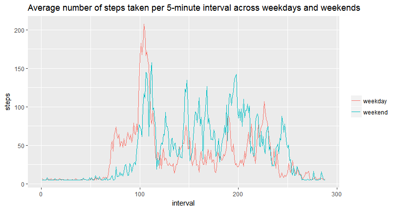

# Load an prepare the data
```r
# Load libraries
library(ggplot2)
library(Hmisc)
```

## Download the data and ensure that the working directory contains downloaded file (setwd())
[link to the data](https://d396qusza40orc.cloudfront.net/repdata%2Fdata%2Factivity.zip)

```r
# Unzip/load the data
if(!file.exists('activity.csv')){
    unzip('repdata%2Fdata%2Factivity.zip')
}
activityData <- read.csv('activity.csv')
```
## Ensure that the date format is appropriate 
```r
activityData$Date <- as.Date(activityData$date, "%Y-%m-%d")
```

```r
# Ensure that interval is a factor variable
activityData$interval <- as.factor(activityData$interval)
```

```r
# Exrtract levels of 5-min intervals
l <- levels(activityData$interval)
```
## Histograms of the total number of steps taken each day
```r
# Calculate total steps 
totalSteps <- tapply(activityData$steps, activityData$date, sum, na.rm = T)
```
```r
# Create a histogram 
hist(totalSteps, breaks = 50, col = "blue", main = "Total Number of steps each day", 
     xlab = "Total Number of Steps")
```
 

```r
# Mean and median number of steps taken each day
totalStepsMean <- mean(totalSteps)
totalStepsMedian <- median(totalSteps)
```
*Mean 9354*  
*Median 10395*
## Time series plot of the average number of steps taken
```r
# Calculate the average number of steps grouped by intereval
averageSteps = tapply(activityData$steps, activityData$interval, mean, na.rm = T)
```
```r
# Convert levels of intervals into numeric
Interval <- as.numeric(l)
```
```r
# Data frame is created in order to plot the data
df <- data.frame(averageSteps, Interval)
```
```r
#plot
ggplot(df, aes(Interval, averageSteps)) + geom_line(colour = "blue") + ggtitle("Time series plot") + 
    ylab("Average Number of Steps")
 ```
  
 
 ```r
 # FInd out which interval contains highest average steps
 which.max(df$averageSteps)
 ```
 *Max interval at 835*
 ## Code to describe and show a strategy for imputing missing data
 
```r
# First run summary for determining overall situation with the data set and missing values
summary(activityData)
```
*Number of missing values: 2304 or ~13% from the total data, what may cause a problem*

```r
# In order to deal with the problem missing values will be replaced with the mean values
activityDataImputed <- activityData
activityDataImputed$steps <- impute(activityData$steps, fun=mean)
```
```r
# Calculate new total steps
totalStepsImputed <- tapply(activityDataImputed$steps, activityDataImputed$date, sum)
```

```r
# plot
hist(totalStepsImputed, breaks = 50, col = "blue", main = "Total Number of steps each day (NA imputed as mean)", 
     xlab = "Total Number of Steps")
```
 

```r
# Mean and median number of steps taken each day
totalStepsImputedMean <- mean(totalStepsImputed)
totalStepsImputedMedian <- median(totalStepsImputed)
```
*Mean Imputed 10766*  
*Median Imputed 10766*

```r
#
activityDataImputed$dateType <-  ifelse(as.POSIXlt(activityDataImputed$date)$wday %in% c(0,6), 'weekend', 'weekday')
#
averagedActivityDataImputed <- aggregate(steps ~ interval + dateType, data=activityDataImputed, mean)
# For plotting reasons we define interval as integer
averagedActivityDataImputed$interval <- as.integer(averagedActivityDataImputed$interval)
```
```r
#plot
ggplot(averagedActivityDataImputed, aes(interval, steps, fill = dateType, colour = dateType)) + geom_line() + labs(colour = "") + ggtitle("Average number of steps taken per 5-minute interval across weekdays and weekends")
```
 
